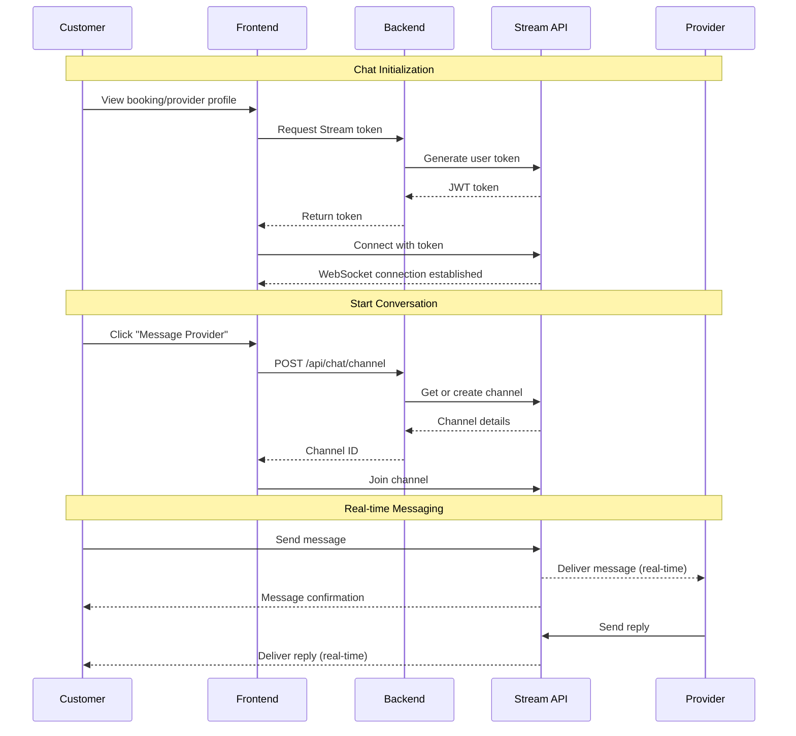

# Real-time Chat Integration with Stream

## Overview

Integrate Stream Chat to enable real-time messaging between customers and providers. Chat will be contextually linked to bookings, allowing seamless communication about service details, scheduling, and updates.

## Architecture



---

## Phase 1: Backend Setup

### 1.1 Install Stream SDK

**Directory:** `backend/`

```bash
npm install stream-chat
```

### 1.2 Environment Configuration

**File:** `backend/.env` (update)

```env
STREAM_API_KEY=your_stream_api_key
STREAM_API_SECRET=your_stream_api_secret
```

### 1.3 Stream Service

**File:** `backend/src/services/stream.service.js` (create)

Core Stream operations:

```javascript
import { StreamChat } from 'stream-chat';

class StreamService {
  constructor() {
    this.client = StreamChat.getInstance(
      process.env.STREAM_API_KEY,
      process.env.STREAM_API_SECRET
    );
  }

  // Generate user token
  createUserToken(userId) {}

  // Create or get channel for booking
  createBookingChannel(bookingId, customerId, providerId) {}

  // Update user in Stream
  upsertUser(userId, userData) {}

  // Send system message
  sendSystemMessage(channelId, message) {}
}
```

**Methods:**

- `createUserToken(userId)` - Generate JWT for frontend
- `upsertUser(userId, userData)` - Create/update user in Stream
- `createBookingChannel(bookingId, customerId, providerId)` - Create 1-on-1 channel
- `getOrCreateChannel(channelId, members)` - Get existing or create new
- `sendSystemMessage(channelId, message)` - Send automated messages
- `deleteChannel(channelId)` - Remove channel (optional)

### 1.4 Chat Controller

**File:** `backend/src/controllers/chat.controller.js` (create)

```javascript
// POST /api/chat/token - Get Stream token
export const getStreamToken = async (req, res) => {
  const userId = req.user.id;
  const token = await streamService.createUserToken(userId);
  res.json({ token, apiKey: process.env.STREAM_API_KEY });
};

// POST /api/chat/channel - Create/get booking channel
export const createBookingChannel = async (req, res) => {
  const { bookingId } = req.body;
  // Verify user is part of booking
  // Create channel
  // Return channel details
};

// GET /api/chat/channels - Get user's channels
export const getUserChannels = async (req, res) => {
  // Return list of channels user is part of
};
```

**Endpoints:**

- `GET /api/chat/token` - Get Stream authentication token
- `POST /api/chat/channel` - Create/get channel for booking
- `GET /api/chat/channels` - List user's chat channels
- `POST /api/chat/channel/:channelId/system-message` - Send system notification

### 1.5 Chat Routes

**File:** `backend/src/routes/chat.routes.js` (create)

```javascript
import express from 'express';
import * as chatController from '../controllers/chat.controller.js';
import { authenticate } from '../middleware/auth.js';

const router = express.Router();

router.use(authenticate);

router.get('/token', chatController.getStreamToken);
router.post('/channel', chatController.createBookingChannel);
router.get('/channels', chatController.getUserChannels);

export default router;
```

### 1.6 Register Routes

**File:** `backend/src/server.js` (update)

```javascript
import chatRoutes from './routes/chat.routes.js';

app.use('/api/v1/chat', chatRoutes);
```

### 1.7 Webhook Handler (Optional)

**File:** `backend/src/controllers/chat.controller.js` (update)

Handle Stream webhooks for events:

- New message → Send push notification
- Channel created → Log event
- User banned → Update database

```javascript
export const handleWebhook = async (req, res) => {
  const event = req.body;
  
  switch(event.type) {
    case 'message.new':
      // Send notification to offline users
      break;
    case 'channel.created':
      // Log channel creation
      break;
  }
  
  res.json({ success: true });
};
```

---

## Phase 2: Frontend Setup

### 2.1 Install Stream React SDK

**Directory:** `frontend/`

```bash
npm install stream-chat stream-chat-react
```

### 2.2 Stream Context Provider

**File:** `frontend/src/contexts/StreamChatContext.jsx` (create)

Manage Stream client and connection:

```javascript
import { createContext, useContext, useEffect, useState } from 'react';
import { StreamChat } from 'stream-chat';
import { useAuth } from './AuthContext';
import { getStreamToken } from '../services/chatService';

const StreamChatContext = createContext();

export const StreamChatProvider = ({ children }) => {
  const [client, setClient] = useState(null);
  const [isReady, setIsReady] = useState(false);
  const { user, isAuthenticated } = useAuth();

  useEffect(() => {
    if (!isAuthenticated || !user) return;

    const initStream = async () => {
      const { token, apiKey } = await getStreamToken();
      const streamClient = StreamChat.getInstance(apiKey);
      
      await streamClient.connectUser(
        {
          id: user.id,
          name: user.name,
          image: user.avatar || `https://ui-avatars.com/api/?name=${user.name}`,
        },
        token
      );
      
      setClient(streamClient);
      setIsReady(true);
    };

    initStream();

    return () => {
      if (client) client.disconnectUser();
    };
  }, [isAuthenticated, user]);

  return (
    <StreamChatContext.Provider value={{ client, isReady }}>
      {children}
    </StreamChatContext.Provider>
  );
};

export const useStreamChat = () => useContext(StreamChatContext);
```

### 2.3 Wrap App with Provider

**File:** `frontend/src/main.jsx` (update)

```javascript
import { StreamChatProvider } from './contexts/StreamChatContext';

<AuthProvider>
  <StreamChatProvider>
    <App />
  </StreamChatProvider>
</AuthProvider>
```

### 2.4 Chat Service

**File:** `frontend/src/services/chatService.js` (create)

API calls for chat operations:

```javascript
import api from '../lib/api';

export const getStreamToken = async () => {
  const { data } = await api.get('/chat/token');
  return data;
};

export const createBookingChannel = async (bookingId) => {
  const { data } = await api.post('/chat/channel', { bookingId });
  return data;
};

export const getUserChannels = async () => {
  const { data } = await api.get('/chat/channels');
  return data;
};
```

---

## Phase 3: Chat UI Components

### 3.1 Custom Chat Theme

**File:** `frontend/src/styles/streamChat.css` (create)

Override Stream's default styles to match Karigar theme:

```css
/* Import Stream default styles */
@import 'stream-chat-react/dist/css/v2/index.css';

/* Custom overrides */
.str-chat {
  --primary-color: #0284C7;
  --primary-color-alpha: rgba(2, 132, 199, 0.1);
  /* ... more theme variables */
}

.str-chat__message--me .str-chat__message-bubble {
  background: #0284C7;
}
```

### 3.2 Chat Button Component

**File:** `frontend/src/components/chat/ChatButton.jsx` (create)

Reusable button to open chat:

```javascript
const ChatButton = ({ bookingId, providerId, providerName }) => {
  const navigate = useNavigate();
  
  const handleOpenChat = async () => {
    const channel = await createBookingChannel(bookingId);
    navigate(`/chat/${channel.id}`);
  };

  return (
    <button onClick={handleOpenChat}>
      <MessageCircle /> Message {providerName}
    </button>
  );
};
```

Props:
- `bookingId` - Associated booking
- `providerId` - Provider to chat with
- `providerName` - Display name
- `className` - Custom styling

### 3.3 Chat Window Component

**File:** `frontend/src/components/chat/ChatWindow.jsx` (create)

Full-screen chat interface using Stream components:

```javascript
import { Channel, MessageInput, MessageList, Window } from 'stream-chat-react';

const ChatWindow = ({ channel }) => {
  if (!channel) return <div>Loading...</div>;

  return (
    <Channel channel={channel}>
      <Window>
        <MessageList />
        <MessageInput />
      </Window>
    </Channel>
  );
};
```

Features:
- Message list with scroll
- Rich text input
- File upload support
- Typing indicators
- Read receipts
- Link previews

### 3.4 Channel List Component

**File:** `frontend/src/components/chat/ChannelList.jsx` (create)

Sidebar showing all conversations:

```javascript
import { ChannelList as StreamChannelList } from 'stream-chat-react';

const ChannelList = ({ onSelectChannel }) => {
  const { user } = useAuth();

  const filters = { 
    type: 'messaging', 
    members: { $in: [user.id] } 
  };
  
  const sort = { last_message_at: -1 };

  return (
    <StreamChannelList
      filters={filters}
      sort={sort}
      onSelect={onSelectChannel}
    />
  );
};
```

### 3.5 Custom Message Component

**File:** `frontend/src/components/chat/BookingMessage.jsx` (create)

Custom message type for booking updates:

```javascript
const BookingMessage = ({ message }) => {
  const bookingData = message.booking;
  
  return (
    <div className="booking-system-message">
      <div className="flex items-center gap-2">
        <Calendar className="text-primary" />
        <div>
          <p className="font-semibold">Booking #{bookingData.bookingNumber}</p>
          <p className="text-sm text-neutral-600">
            {bookingData.status === 'confirmed' && 'Booking confirmed!'}
            {bookingData.status === 'cancelled' && 'Booking cancelled'}
          </p>
          <Link to={`/bookings/${bookingData._id}`}>View Details</Link>
        </div>
      </div>
    </div>
  );
};
```

---

## Phase 4: Chat Pages

### 4.1 Main Chat Page

**File:** `frontend/src/pages/ChatPage.jsx` (create)

Full chat interface with channel list and window:

```javascript
const ChatPage = () => {
  const { client, isReady } = useStreamChat();
  const { channelId } = useParams();
  const [activeChannel, setActiveChannel] = useState(null);

  useEffect(() => {
    if (!client || !channelId) return;
    
    const channel = client.channel('messaging', channelId);
    channel.watch();
    setActiveChannel(channel);
  }, [client, channelId]);

  if (!isReady) return <LoadingSpinner />;

  return (
    <Chat client={client} theme="messaging light">
      <div className="flex h-screen">
        {/* Sidebar with channel list */}
        <div className="w-80 border-r">
          <ChannelList onSelectChannel={setActiveChannel} />
        </div>
        
        {/* Main chat window */}
        <div className="flex-1">
          {activeChannel ? (
            <ChatWindow channel={activeChannel} />
          ) : (
            <EmptyState message="Select a conversation" />
          )}
        </div>
      </div>
    </Chat>
  );
};
```

**Layout:**
- Left: Channel list with unread badges
- Right: Active conversation
- Mobile: Stack with back button

### 4.2 Inbox Page

**File:** `frontend/src/pages/InboxPage.jsx` (create)

Chat landing page showing all conversations:

```javascript
const InboxPage = () => {
  const { client, isReady } = useStreamChat();
  const navigate = useNavigate();

  const handleChannelClick = (channel) => {
    navigate(`/chat/${channel.id}`);
  };

  return (
    <div className="container mx-auto py-8">
      <h1 className="text-3xl font-bold mb-6">Messages</h1>
      
      <Chat client={client} theme="messaging light">
        <ChannelList 
          onSelectChannel={handleChannelClick}
          Preview={CustomChannelPreview}
        />
      </Chat>
    </div>
  );
};
```

### 4.3 Custom Channel Preview

**File:** `frontend/src/components/chat/CustomChannelPreview.jsx` (create)

Custom preview for channel list items:

```javascript
const CustomChannelPreview = ({ channel, latestMessage }) => {
  const { booking } = channel.data; // Custom metadata
  
  return (
    <div className="p-4 hover:bg-neutral-50 cursor-pointer">
      <div className="flex items-start gap-3">
        
        <div className="flex-1">
          <div className="flex justify-between items-start">
            <h3 className="font-semibold">{otherUser.name}</h3>
            <span className="text-xs text-neutral-500">
              {formatTime(latestMessage.created_at)}
            </span>
          </div>
          
          {booking && (
            <p className="text-xs text-primary">
              Booking #{booking.bookingNumber}
            </p>
          )}
          
          <p className="text-sm text-neutral-600 truncate">
            {latestMessage.text}
          </p>
        </div>
        
        {channel.countUnread() > 0 && (
          <span className="bg-primary text-white text-xs rounded-full px-2 py-1">
            {channel.countUnread()}
          </span>
        )}
      </div>
    </div>
  );
};
```

---

## Phase 5: Integration with Booking System

### 5.1 Add Chat Button to Booking Details

**File:** `frontend/src/pages/customer/BookingDetailsPage.jsx` (update)

Add "Message Provider" button:

```javascript
<div className="flex gap-3">
  <ChatButton 
    bookingId={booking._id}
    providerId={booking.provider._id}
    providerName={booking.provider.businessName}
  />
  {/* Other action buttons */}
</div>
```

**File:** `frontend/src/pages/provider/ProviderBookingDetailsPage.jsx` (update)

Add "Message Customer" button:

```javascript
<ChatButton 
  bookingId={booking._id}
  customerId={booking.customer._id}
  customerName={booking.customerName}
/>
```

### 5.2 Add Chat to Provider Profile

**File:** `frontend/src/pages/ProviderProfilePage.jsx` (update)

Add chat button next to "Book Service":

```javascript
<div className="flex gap-3">
  <button onClick={() => setShowBookingModal(true)}>
    Book Service
  </button>
  
  {/* Show only if user has existing booking with provider */}
  {hasExistingBooking && (
    <ChatButton 
      bookingId={existingBooking._id}
      providerId={provider._id}
      providerName={provider.businessName}
    />
  )}
</div>
```

### 5.3 System Messages on Booking Actions

**Backend Integration:**

Send automated messages when booking status changes:

**File:** `backend/src/controllers/booking.controller.js` (update)

```javascript
import { streamService } from '../services/stream.service.js';

export const confirmBooking = async (req, res) => {
  // ... existing confirm logic ...
  
  // Send system message
  await streamService.sendSystemMessage(
    booking.channelId,
    {
      type: 'booking_confirmed',
      text: 'Booking has been confirmed by the provider',
      booking: {
        _id: booking._id,
        bookingNumber: booking.bookingNumber,
        status: 'confirmed'
      }
    }
  );
};
```

**Trigger messages for:**
- Booking created → "New booking request received"
- Booking confirmed → "Your booking has been confirmed"
- Booking cancelled → "Booking has been cancelled"
- Service started → "Service is now in progress"
- Service completed → "Service completed, please review"

### 5.4 Unread Message Badge

**File:** `frontend/src/components/layout/Navbar.jsx` (update)

Add messages icon with unread count:

```javascript
const { client } = useStreamChat();
const [unreadCount, setUnreadCount] = useState(0);

useEffect(() => {
  if (!client) return;
  
  const handleEvent = () => {
    const count = client.user.total_unread_count;
    setUnreadCount(count);
  };
  
  client.on('notification.message_new', handleEvent);
  return () => client.off('notification.message_new', handleEvent);
}, [client]);

<Link to="/inbox" className="relative">
  <MessageCircle />
  {unreadCount > 0 && (
    <span className="absolute -top-2 -right-2 bg-red-500 text-white text-xs rounded-full w-5 h-5 flex items-center justify-center">
      {unreadCount > 9 ? '9+' : unreadCount}
    </span>
  )}
</Link>
```

---

## Phase 6: Routes & Navigation

### 6.1 Add Chat Routes

**File:** `frontend/src/App.jsx` (update)

```javascript
// Chat routes
<Route path="/inbox" element={<ProtectedRoute><InboxPage /></ProtectedRoute>} />
<Route path="/chat/:channelId" element={<ProtectedRoute><ChatPage /></ProtectedRoute>} />
```

### 6.2 Update Navigation

**File:** `frontend/src/components/layout/Navbar.jsx` (update)

Add "Messages" link to navigation:

```javascript
{isAuthenticated && (
  <Link to="/inbox" className="nav-link">
    <MessageCircle className="w-5 h-5" />
    Messages
    {unreadCount > 0 && <Badge>{unreadCount}</Badge>}
  </Link>
)}
```

---

## Phase 7: Advanced Features

### 7.1 File Upload

Configure file uploads in Stream:

```javascript
// In ChatWindow component
<MessageInput 
  acceptedFiles={['image/*', 'application/pdf']}
  maxNumberOfFiles={5}
  multipleUploads={true}
/>
```

### 7.2 Typing Indicators

Already built-in with Stream components, ensure enabled:

```javascript
<Channel channel={channel} TypingIndicator={CustomTypingIndicator}>
  {/* ... */}
</Channel>
```

### 7.3 Push Notifications (Future)

Setup for mobile apps:

- Configure FCM/APN in Stream dashboard
- Send device tokens from mobile apps
- Stream handles notification delivery

### 7.4 Message Moderation

Add auto-moderation in Stream dashboard:
- Profanity filter
- Spam detection
- Block/report functionality

### 7.5 Chat History Export

Add button to export chat as PDF:

```javascript
const exportChatHistory = async (channel) => {
  const messages = await channel.query({ messages: { limit: 100 } });
  // Convert to PDF using jsPDF
};
```

---

## Mobile Responsiveness

### Chat Page Layout

**Desktop:**
```
┌─────────────┬───────────────────────────┐
│   Channel   │                           │
│    List     │      Chat Window          │
│  (sidebar)  │                           │
└─────────────┴───────────────────────────┘
```

**Mobile:**
```
Show channel list by default
Clicking channel → Navigate to chat window
Back button → Return to channel list
```

Implement with:

```javascript
const [showChannelList, setShowChannelList] = useState(true);
const isMobile = useMediaQuery('(max-width: 768px)');

{isMobile ? (
  showChannelList ? <ChannelList /> : <ChatWindow />
) : (
  <>
    <ChannelList />
    <ChatWindow />
  </>
)}
```

---

## Testing Checklist

### Backend
- [ ] Stream token generation works
- [ ] Channels created correctly with booking context
- [ ] System messages sent on booking updates
- [ ] Webhook handling works (if implemented)

### Frontend
- [ ] Stream connection establishes on login
- [ ] Chat button appears on booking pages
- [ ] Clicking chat button opens channel
- [ ] Messages send/receive in real-time
- [ ] Unread count updates correctly
- [ ] File uploads work
- [ ] Typing indicators show
- [ ] Mobile layout responds properly

### Integration
- [ ] Chat linked to correct booking
- [ ] Can only chat with involved parties
- [ ] System messages appear for booking events
- [ ] Navigation between inbox and chat works

---

## Security Considerations

1. **Authentication:**
   - Stream tokens expire after 1 hour (configurable)
   - Tokens tied to specific user ID
   - Backend validates booking access before creating channel

2. **Authorization:**
   - Channels restricted to booking participants
   - Cannot join channels user is not member of
   - Admin can moderate all channels (optional)

3. **Data Privacy:**
   - Messages encrypted in transit (HTTPS/WSS)
   - Stream stores messages (check data residency settings)
   - Implement message deletion policy

4. **Rate Limiting:**
   - Stream has built-in rate limits
   - Prevent spam with message throttling
   - Block/report functionality for abuse

---

## File Structure Summary

```
backend/src/
├── controllers/
│   └── chat.controller.js ⭐ NEW
├── routes/
│   └── chat.routes.js ⭐ NEW
├── services/
│   └── stream.service.js ⭐ NEW
└── server.js (update)

frontend/src/
├── pages/
│   ├── ChatPage.jsx ⭐ NEW
│   ├── InboxPage.jsx ⭐ NEW
│   ├── customer/
│   │   └── BookingDetailsPage.jsx (update)
│   ├── provider/
│   │   └── ProviderBookingDetailsPage.jsx (update)
│   └── ProviderProfilePage.jsx (update)
├── components/
│   ├── chat/
│   │   ├── ChatButton.jsx ⭐ NEW
│   │   ├── ChatWindow.jsx ⭐ NEW
│   │   ├── ChannelList.jsx ⭐ NEW
│   │   ├── CustomChannelPreview.jsx ⭐ NEW
│   │   └── BookingMessage.jsx ⭐ NEW
│   └── layout/
│       └── Navbar.jsx (update)
├── contexts/
│   └── StreamChatContext.jsx ⭐ NEW
├── services/
│   └── chatService.js ⭐ NEW
├── styles/
│   └── streamChat.css ⭐ NEW
├── App.jsx (update)
└── main.jsx (update)
```

---

## Environment Variables Summary

**Backend:**
```env
STREAM_API_KEY=your_key_here
STREAM_API_SECRET=your_secret_here
```

**Frontend:**
No direct environment variables needed (API key provided by backend)

---

## Success Criteria

✅ Customers can message providers about bookings  
✅ Real-time message delivery (< 1 second latency)  
✅ Unread message indicators working  
✅ System messages sent on booking status changes  
✅ Mobile-responsive chat interface  
✅ File sharing works (images, PDFs)  
✅ Typing indicators and read receipts functional  
✅ Chat history persists across sessions  
✅ Seamless integration with existing booking flow  

---

## Estimated Implementation Time

- **Phase 1 (Backend):** 2-3 hours
- **Phase 2 (Frontend Setup):** 1-2 hours
- **Phase 3 (UI Components):** 3-4 hours
- **Phase 4 (Chat Pages):** 2-3 hours
- **Phase 5 (Booking Integration):** 2-3 hours
- **Phase 6 (Routes):** 0.5 hours
- **Phase 7 (Advanced):** 2-3 hours (optional)

**Total:** ~13-18 hours

---

## Resources

- [Stream Chat Docs](https://getstream.io/chat/docs/)
- [Stream React SDK](https://getstream.io/chat/docs/sdk/react/)
- [Stream Node.js SDK](https://getstream.io/chat/docs/node/)
- [UI Customization Guide](https://getstream.io/chat/docs/sdk/react/theming/introduction/)

